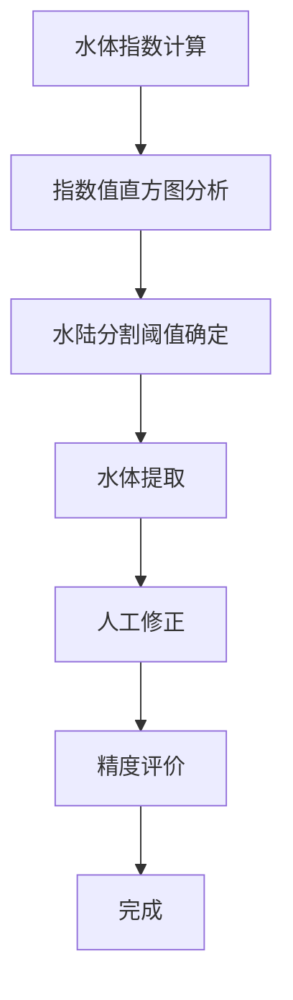

# **实验一：基于开源GIS软件水体自动遥感提取及人工改正**
## 学号：20221170106  姓名：杨韦嘉

## 数据提供：
>6波段Landsat影像编号17一幅，水体提取矢量结果一份。原始图像如下所示

## 作业内容：
**实验流程图：**

1）利用开源桌面GIS软件采用水体指数方法进行水体信息遥感提取。

2）对所提供水体提取结果进行人工改正，获得准确水体范围。

3）对比水体指数方法获得水体范围和所提供水体提取结果精度情况。

## 实验步骤：

### 1.波段计算MNDWI：  Raster>Band Math> 在弹出的窗口中输入相应的参数

 (1) 在Landset影像中对应的波段分别为第2波段和第5波段为影像的绿波段和中红外波段。
$$MNDWI=（band2-band5）/（band2+band5）=（GREEN-MIR）/（GREEN+MIR）$$

 (2)输入MNDWI作为输出波段的名称： 点击确定即可输出计算的归一化水体指数MNDWI：

 (3)通过分析统计工具，检测水体指数是否介于-1和1之间。从统计数据可以看出，最大值为0.681，最小值为-0.431，介于-1和1之间，具体数值如下所示：

## 2.mndwi指数值影像二值化：点击Analysis/Histogram可以查看波段的直方图，该直方图中确定水体与非水体之间的阈值以进行二值化

 (1)直方图阈值通过观察可以得到大概为0.27

 (2)进行波段计算，MNDWI进行二值化，大于0.27的栅格赋值为1，小于0.27的栅格赋值为0，实现影像的二值化。

## 3.mndwi水体信息矢量化

 (1)在QGIS中打开已经在SNAP软件输出的MNDWI波段的影像：

 (2)如下图所示，为在QGIS中打开的MNDWI影像数据，可以在图层中看到数值为1和0，即为二值化影像的数据：

 (3)在QGIS中gdal工具中找到栅格矢量化的工具

 (4)在QGIS中进入编辑模式，可以对矢量进行修改，增加或者删除。如下所示：可以对矢量进行添加修改的操作：

  也可以进行删除操作，选中对象并操作：

## 实验结果：
  实验后得到了影像的水体矢量一份，如图所示

  与提供的水体矢量相比较，实验提取出的水体矢量更加准确，参考水体矢量将影像的四周边框误识别成水体，在与原始影像相对比，实验得出的矢量的水体提取更加准确。

## 实验心得：
  本次实验，进行了使用开源桌面GIS软件对一幅影像进行了水体的提取，熟悉与了解了开源软件的使用和操作。在本次实验中，主要是在阈值的确定上遇到了些小问题，在分析MNDWI波段的直方图时阈值的选择十分重要，根据这幅影像的实际情况应该选择0.27作为影像二值化的阈值。在其他的实验过程中较为顺利地完成。